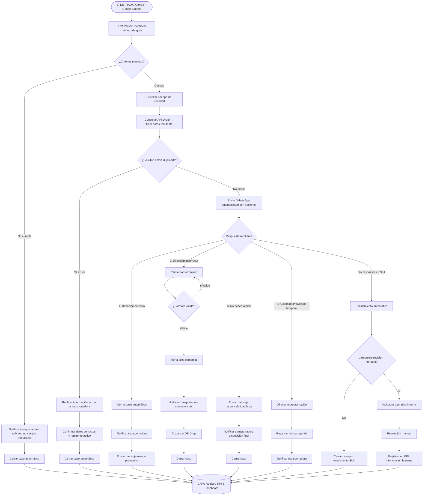

# dropi-solucion-novedades
Automatización CRM – Proceso Solución de Novedades Devoluciones

```mermaid
flowchart TB
    A(["📧 ENTRADA: Correo / Google Sheets"]) --> B["CRM Parser: Identificar número de guía"]
    B --> C{"¿Criterios mínimos?"}
    C -- No cumple --> C1["Notificar transportadora: solicitud no cumple requisitos"]
    C1 --> C2["Cerrar caso automático"]
    C2 --> Z[("CRM: Registro KPI & Dashboard")]
    C -- Cumple --> D["Priorizar por tipo de novedad"]
    D --> E["Consultar API Dropi → traer datos remitente"]
    E --> F{"¿Solicitud activa duplicada?"}
    F -- Sí existe --> F1["Replicar información actual a transportadora"]
    F1 --> F2["Confirmar datos correctos y remitente activo"]
    F2 --> F3["Cerrar caso automático"]
    F3 --> Z
    F -- No existe --> G["Enviar WhatsApp automatizado con opciones"]
    G --> H{"Respuesta remitente"}
    H -- 1: Dirección correcta --> I["Cerrar caso automático"]
    I --> I1["Notificar transportadora"]
    I1 --> I2["Enviar mensaje rezago preventivo"]
    H -- 2: Dirección incorrecta --> J["Reintentar formulario"]
    J --> J1{"¿Formato válido?"}
    J1 -- Inválido --> J
    J1 -- Válido --> J2["Alerta área comercial"]
    J2 --> J3["Notificar transportadora con nueva dir."]
    J3 --> J4["Actualizar DB Dropi"]
    J4 --> J5["Cerrar caso"]
    H -- 3: No desea recibir --> K["Enviar mensaje responsabilidad legal"]
    K --> K1["Notificar transportadora disposición final"]
    K1 --> K2["Cerrar caso"]
    H -- 4: Calamidad/novedad temporal --> L["Ofrecer reprogramación"]
    L --> L1["Registrar fecha sugerida"]
    L1 --> L2["Notificar transportadora"]
    H -- Sin respuesta en SLA --> M["Escalamiento automático"]
    M --> N{"¿Requiere revisión humana?"}
    N -- Sí --> N1["Validador operativo interno"]
    N -- No --> N2["Cerrar caso por vencimiento SLA"]
    N1 --> O["Resolución manual"]
    O --> P["Registrar en KPI: Intervención humana"]
    I2 --> Z
    J5 --> Z
    K2 --> Z
    L2 --> Z
    N2 --> Z
    P --> Z
```
